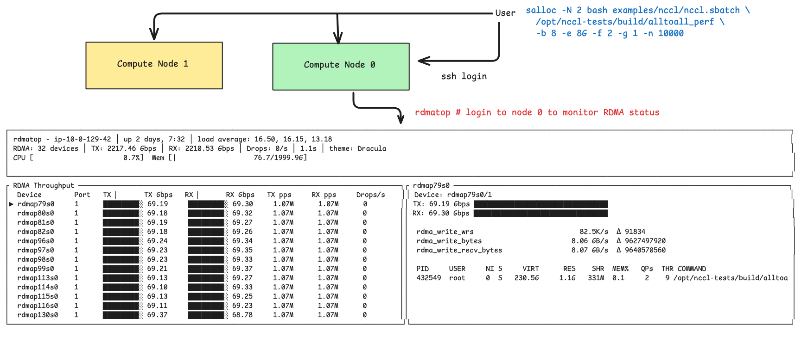

# NCCL

[NCCL](https://github.com/NVIDIA/nccl) is a collective communication
library for GPU communication. It achieves high bandwidth through
NVLink, NVSwitch, or RDMA. On AWS, the
[aws-ofi-nccl](https://github.com/aws/aws-ofi-nccl) plugin enables
NCCL to use EFA for inter-node RDMA communication. The following examples use
[nccl-tests](https://github.com/NVIDIA/nccl-tests) to evaluate
collective performance. If you are using the Dockerfile in this
repo, you can run these on AWS GPU instances (p4d, p5) and use
`rdmatop` to observe RDMA network flow.



## Build

Before launching a NCCL experiment, we have to prepare a container to launch
a NCCL test. If you are using AWS, you can utilize the Dockerfile in this
repository to build a docker image and Enroot sqush file.

```bash
cd rdmatop && make docker
```

## Examples

```bash
cd rdmatop && make docker

# All-Reduce
salloc -N 2 bash examples/nccl/nccl.sbatch \
  /opt/nccl-tests/build/all_reduce_perf \
  -b 8 -e 8G -f 2 -g 1 -n 10000

# All-Gather
salloc -N 2 bash examples/nccl/nccl.sbatch \
  /opt/nccl-tests/build/all_gather_perf \
  -b 8 -e 8G -f 2 -g 1 -n 10000

# Reduce-Scatter
salloc -N 2 bash examples/nccl/nccl.sbatch \
  /opt/nccl-tests/build/reduce_scatter_perf \
  -b 8 -e 8G -f 2 -g 1 -n 10000

# All-to-All
salloc -N 2 bash examples/nccl/nccl.sbatch \
  /opt/nccl-tests/build/alltoall_perf \
  -b 8 -e 8G -f 2 -g 1 -n 10000
```

## Common Flags

| Flag | Description                      |
|------|----------------------------------|
| `-b` | Min message size                 |
| `-e` | Max message size                 |
| `-f` | Step factor between sizes        |
| `-g` | GPUs per thread                  |
| `-n` | Number of iterations             |
| `-w` | Warmup iterations                |
| `-c` | Check correctness (0=off, 1=on)  |
